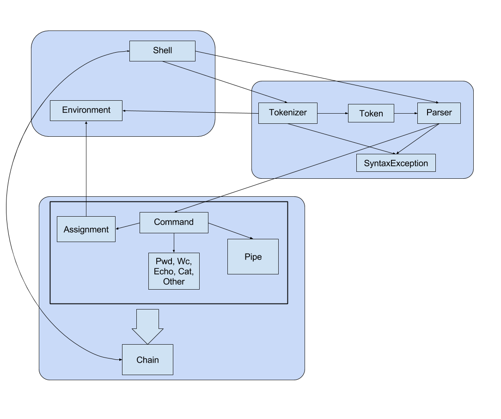

# HW 01: SHELL

## Описание:

* package shell
    * Shell - класс-точка входа, выполняет чтение ввода, вызывает все методы парсинга
    * Environment - singleton, хранит значения переменных окружения и map встроенных команд
* package syntax - содержит классы необходимые для парсинга введённой строки
    * Tokenizer - класс содержащий методы первичной обработки строк, выполнающие
    токенизацию и необходимую подстановку значений
    * Token - хранит информацию о типе данной строчки: команда, аргумент, присвоение, pipe
    * Parser - выполняет группировку аргументов к каждой команде
    * CommandNode - соответствует команде, хранит её аргументы
    * SyntaxException - исключение происходящие во время парсинга
* package commands - содержит классы, реализующие встроенные команды и pipe
    * Command - базовый класс всех команд
    * Wc, Cat, Assignment, Echo, Pwd - классы, соответствующие встроенным командам
    * Other - внешние команды
    * Pipe - класс, перенаправляющий вывод
    * Chain - класс, оборачивающий последовательность команд
    
## Диаграмма

